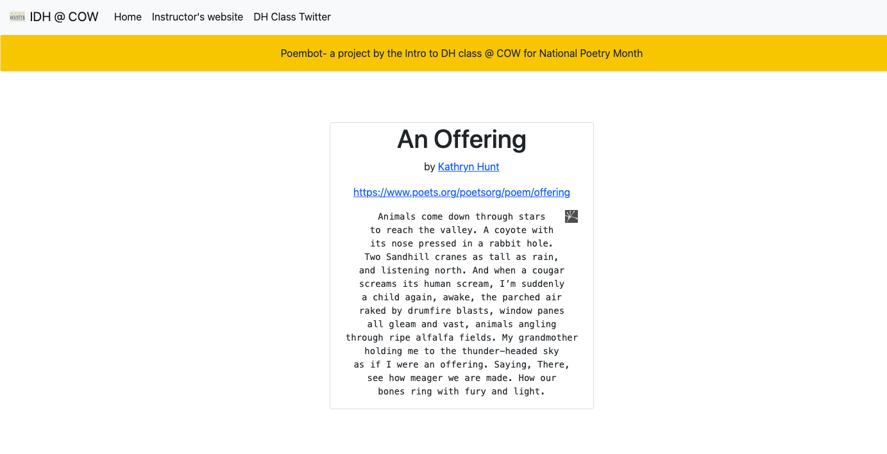

# flask_poembot_app

## Setup instructions

Run the following commands:

1. source /Users/tanaka/Desktop/poembot/venv/bin/activate

2. export FLASK_APP=main.py

3. flask run

4. Finally, access the site locally at port 5000

## Deploying to cloud

gcloud app deploy

## Todo

1. add bs4 library to /libs directory since App Engine doesn't support impure python packages
